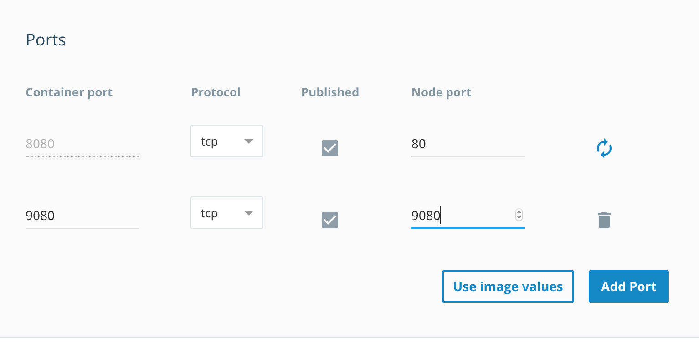

# CMPE202_ProjectGroup29 Random Coders
This repository is for the team project for CMPE202 under Prof. Paul Nguyen.  
[MIT License](./LICENSE)

# Graph Coloring  

## Rationale
This project was created as a supplement to [CSUnplugged's Graph Colouring Activity](http://csunplugged.org/graph-colouring/).  Graph Colouring is a subset of computer science's really hard / intractable problems.  These problems may seem easy to make up, but they require an inordinate amount of time to solve. 

## Basic Concept  
Color a graph (similar to a map), where no adjacent vertex/edge may have the same color.  In addition, graphs must use a minimum number of colors.  

## Design

We have decided the game to be designed as follows:  
1. Pre-built Graphs: Built the graph like continuous curve and fill the intersecting regions.  
2. Designing graphs with predefined shapes as objects and fill them with the given colors as shown  

Check out our [design folder](./DESIGN/) for documents relating to how this project came about.

## Running the game  

The multiplayer game requires that a server is running.  Try it out on localhost.
From your terminal on the base path...  
* Set the environment to localhost:  `make setenv-local`
* Compile the server code: `make compile`  
* Run the server: `make run` 

Now open up greenfoot, compile, and run!   

### Docker -  local machine
Docker allows this game to be packaged and thrown onto the web.
Commands to run docker locally are as follows:  

1. Find out the local IP address via `docker-machine ls`.  The local ip address of the docker machine will be printed.  
2. Modify `MainMenu/GraphClient.java` to match this ip.  Docker machine will be running at port 80.
3. Set environment to docker: `make setenv-docker`  
4. `make compile`  
5. `make app`  
6. `make docker-build`  
7. `make docker-run-bridge`
8. Docker machine will be running at docker-machine ip address at port 80  

### Docker - cloud
Once docker is running on your local machine, it's time to push to the cloud.
Use the script `./docker.sh` in the top level directory to make this job easy.
Prerequisite Accounts:
* AWS Account  
* Docker Hub account  
* Docker Cloud account  
* Docker toolbox  

### Deploying to prod
Once the prerequisites of docker have been completed, run `./docker.sh`.  
1. Select `1` to login  
2. Once logged in, select `3` to build your image  
3. Once image is built, select `6` to push to Docker Hub  
4. Select `9` to release to docker hub.  

5. Log into Docker hub to see that your repo has been pushed to the cloud  
  

6. Deploy the docker image using Docker cloud  

7.  Make sure to open the correct ports.  We are mapping port 8080 to port 80 for the socket server and using port 9080 for the REST maintenance server.  

8.  Make sure that the network type is "Bridge"

9.  Docker Cloud, at time of deployment, required that we first create nodes.  Do that if it is still relevant.  

10. Log into AWS console.  

11.  Some tweaking of security policies was necessary to get the ports reachable.   

12. Take note of the IP address of the EC2 instance in the EC2 instance section  

13.  Once you have the ip address, modify `MainMenu/GraphClient.java` with the ip value for the "prod" region.   

14.  On the shell, run `make setenv-prod`.  This will set the region to prod.  Other valid values are `local` for localhost and `docker` for local docker.  

### Multiple clients
Greenfoot IDE is one client, but for other clients, you will need the jar.  
On top right, there is a Share button.  

Click Share, then go to Application.  

Hit Export.  
The jar file will be compiled and stored in the path.  
Double click the jar file to run the second client.  

## UML Diagrams & Architecture Design
Check out the [documentation here](./UML/README.md).  

## TODO - Free-form graph creation.  Open Issues:  

1. What if a shape is completely encapsulated inside another shape?  (ie. Circle inside a larger square?).  We can deem the square to have the same color, but this is not ideal.  
2. What if a shape bisects another shape?  (ie. Oval bisects a rectangle)  Ideally, we would detect the bisection and make 2 shapes out of the rectangle.  However, based on OOP, the entire rectangle will have the same color.  

Solution #1: Have a way to detect bisection or complete encapsulation based on vertices.  (HARD)  
Solution #2: Use predefined maps (MED)  
Solution #3: Ask user to click inside the map to create vertices, and have program randomly connect the vertices to create shapes. (MED-HARD)  

