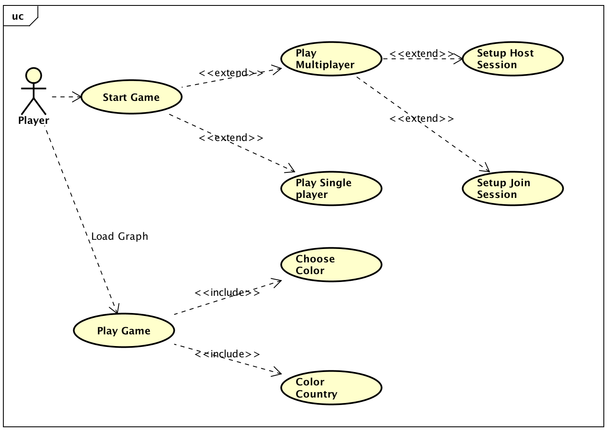
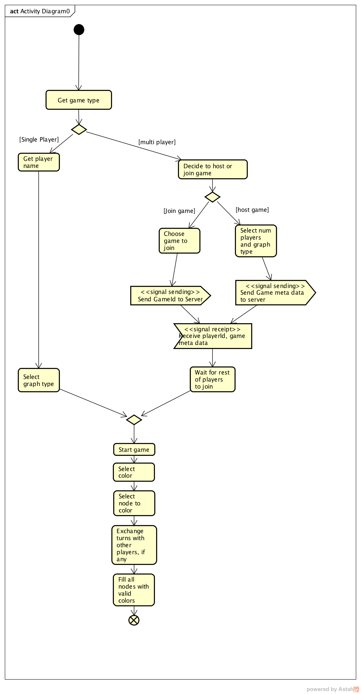
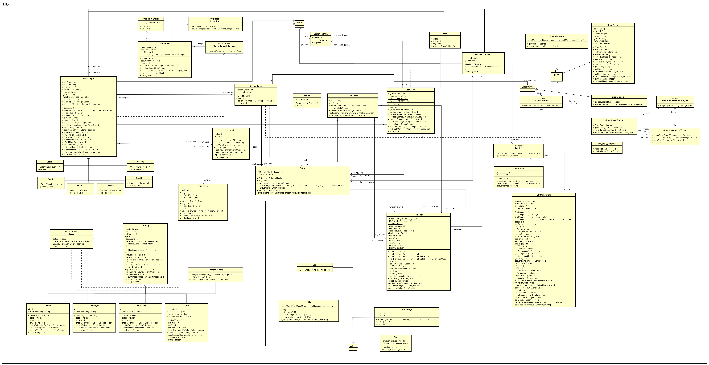
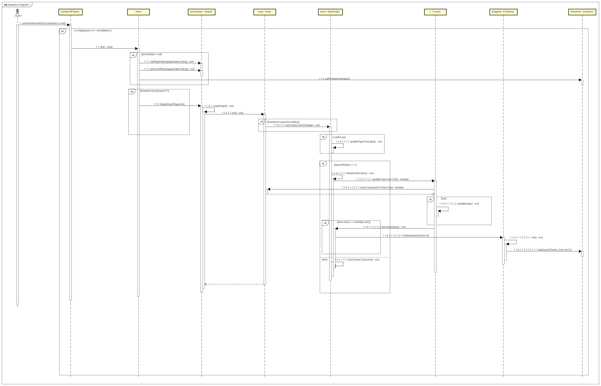
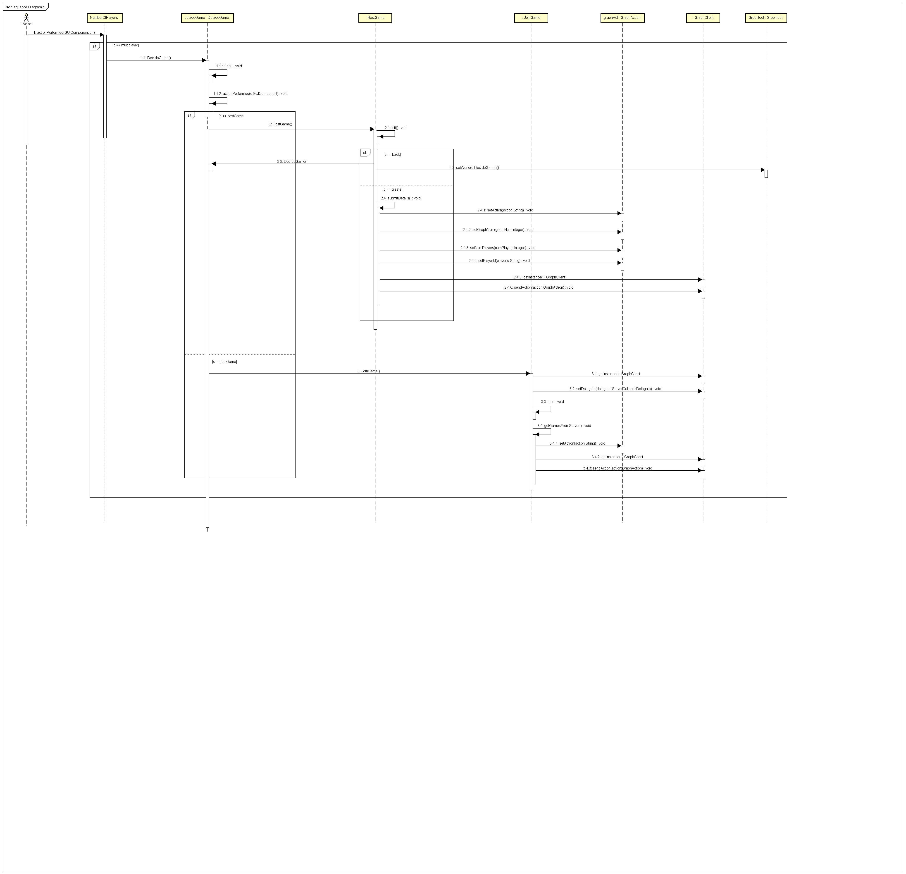

# UML Documentation
This folder contains UML documentation for project structure. 

## User Stories
The below section contains a list of user stories describing our graph game functionality. It has been divided in categories such as user, single player, multiplayer and player for better understanding and to avoid redundancy.

**USER:**

- As a user, I want to be able to launch the game so that I can play it.

- As a user, I want to be able to decide between single player or multiplayer on my screen so that I can launch the game of my choice.

- As a user, I want to be able to select the single player option so that I can play on my own. 

- As a user, I want to be able to select the multiplayer option so that I can play with my friends.

**SINGLE PLAYER:**

- As a single player, I want to be able to have a list of available graphs so that I can pick one to play.

**MULTIPLAYER:**

- As a multiplayer participant, I want to see the options available for multiplayer so that I can make my decision.

- As a multiplayer participant, I want to be able to host a game so that other users can join my session.

- As a multiplayer participant, I want to be able to join an existing game so that I can play with other people.

- As a host player, I want to be able to setup the session so that I can pick my username, the number of players and the graph that I want to play.

- As a non-host player, I want to be able to see the list of available game sessions so that I can join one of my choice.

- As a non-host player, I want to be able to see the information for each game so that I can know the game that I am joining.

- As a non-host player, I want to be able to prompt the game id session so that I can join that specific game. 

- As a non-host player, I want to be ask to prompt my username before joining the game so that other players can recognize me.

- As a multiplayer participant, I want to be notified in my screen each player’s turn so that I can know when it is my turn.

- As a multiplayer participant, I want to be able to see the moves from the other player(s) in my session so that I can see the progress of the game.

**PLAYER:** 

- As a player, I want to be able to see the graph that I have selected on my screen so that I can start playing.

- As a player, I want to have a palette of colors available so that I can pick one color to color a country on the graph.

- As a player, I want to be able to see what color I am selecting so that I can pick between the palette.

- As a player, I want to be able to switch between colors so that I can make my next move.

- As a player, I want to be able to color a country when I click on it so that I can complete the game.

- As a player, I want to be notified when the color of the country is valid or invalid so that I can pick other color if wrong.

- As a player, I want to be able to color all countries on the graph so that I can complete the game.

- As a player, I want to be notified that the game has been completed so that I can see the results.

- As a player, I want to see the timing results at the end of the game so that I can see in how much time the game has been completed.

## Use Cases

[Detail documentation here](./UseCases/Readme.md).  

## Activity Diagram - Jonathan Guan

The below activity diagram displays the user flow and interactions between the game and other players.
The diagram displays flows for both single player and multiplayer.

## Class Diagram - Anubha Mandal

Below is the class diagrams with the implemented design patterns:

##Sequence Diagrams - Veeresh Kamble

The below diagram shows the sequence diagram of the interaction of objects during a single player gameplay

The below diagram shows the sequence diagram of the interaction of objects during a multi player gameplay

## Design Patterns

### Proxy
* GraphClient implements IServerProxy with the methods `send(String payload)` and `setDelegate(IServerCallbackDelegate delegate)`  

### Observer
* BaseGraph is the observer for the server GraphServer, and implements IServerCallbackDelegate method `receiveMove(String move)`

### Iterator / Composite
* GraphGameMonitor implements the iterator pattern by iterating through a composite list of threads spawned by GraphGameServer.
