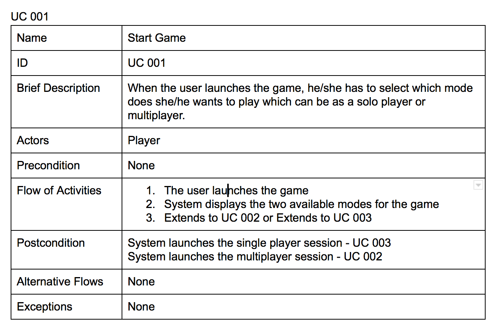
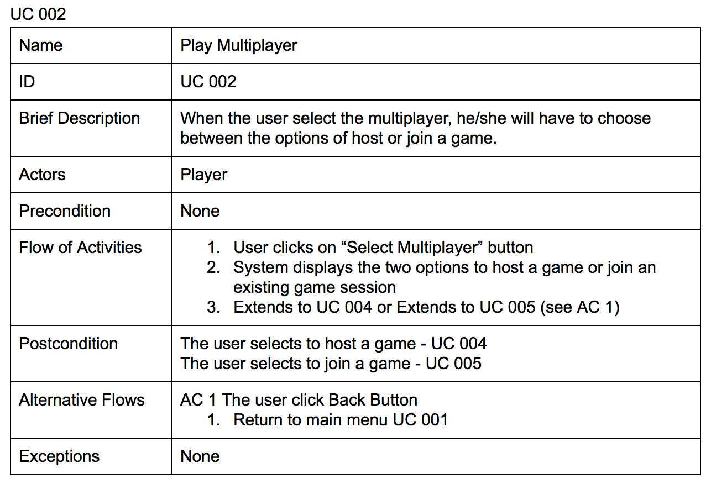
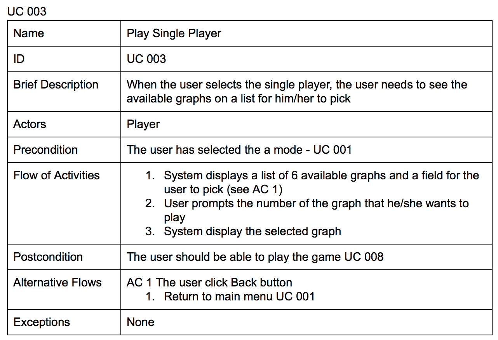
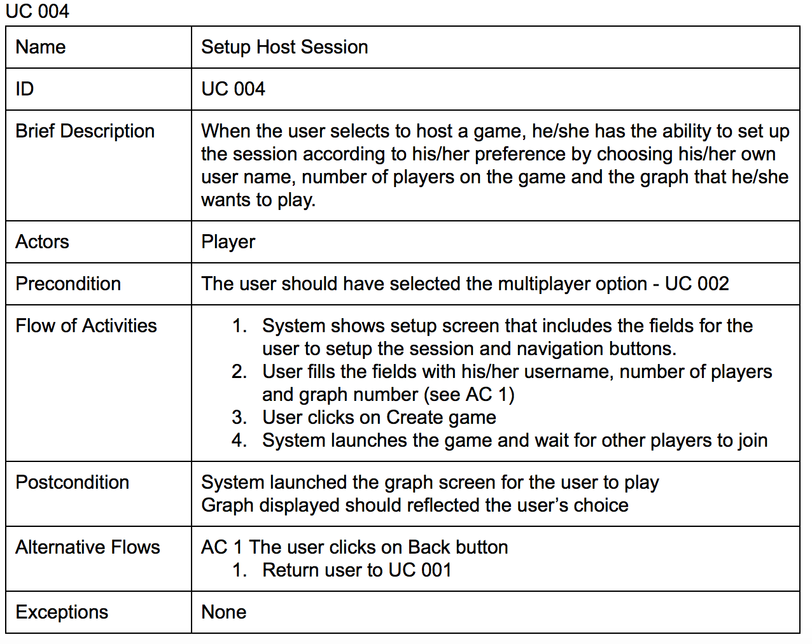
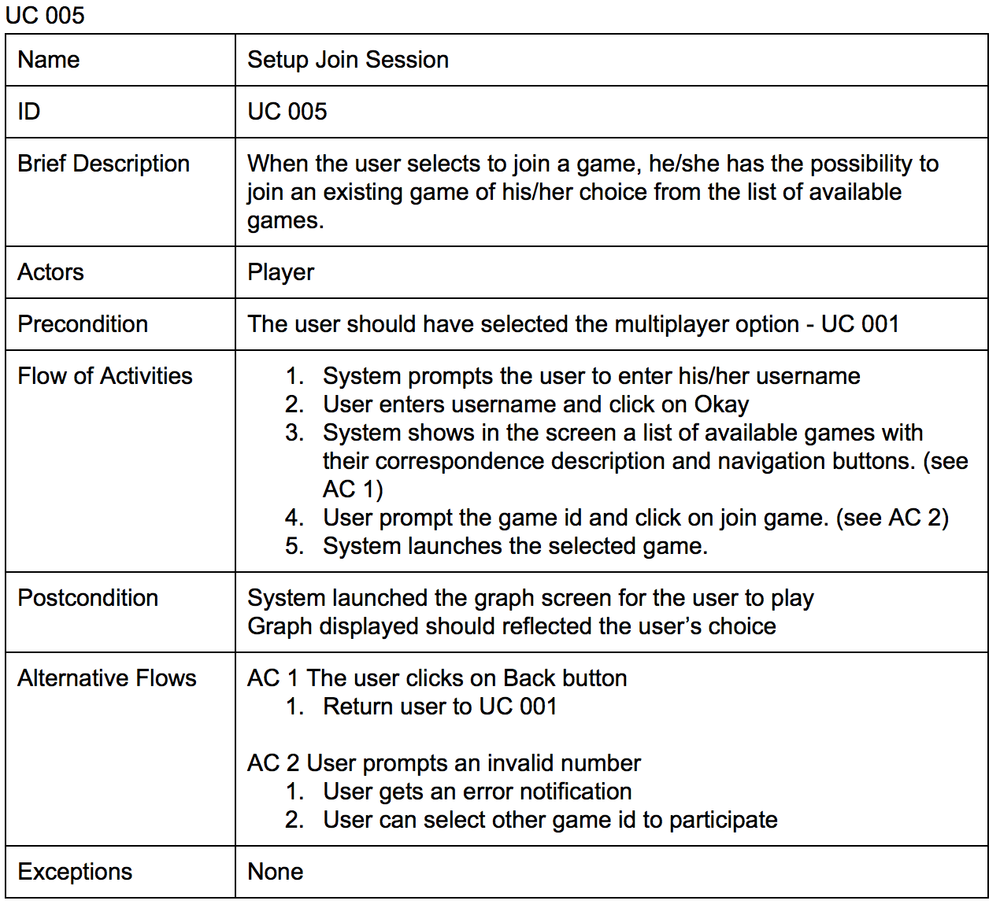
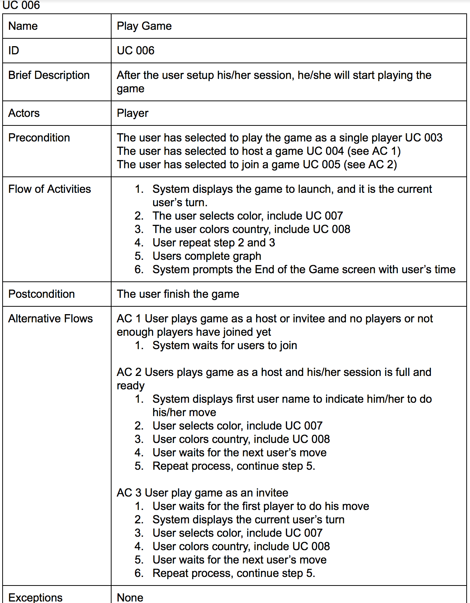
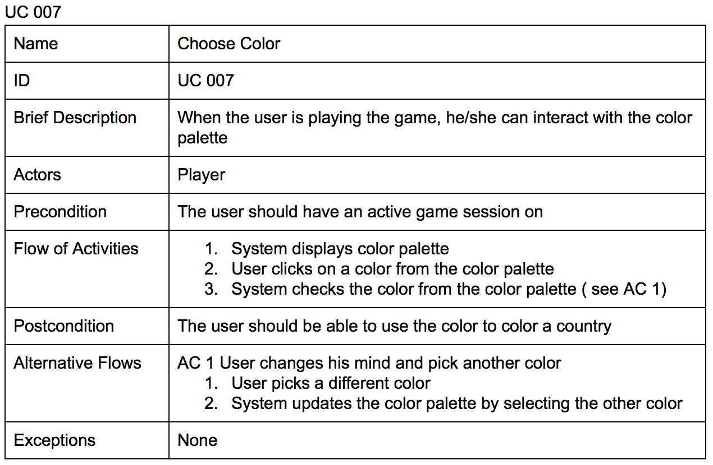
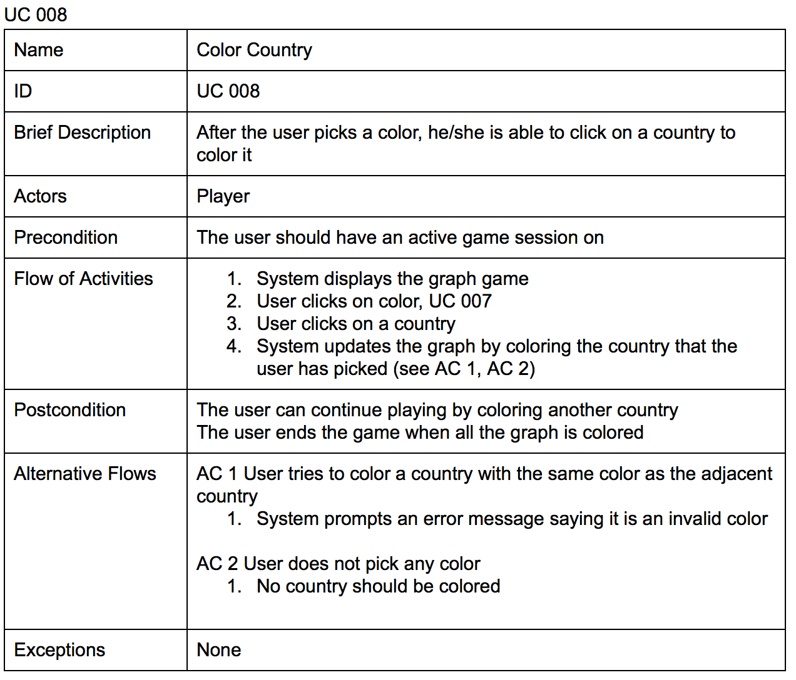

# Use Cases

The below section contains the detailed version of the Use Case diagram

# Use Case 1

# Use Case 2

# Use Case 3

# Use Case 4

# Use Case 5

# Use Case 6

# Use Case 7

# Use Case 8

